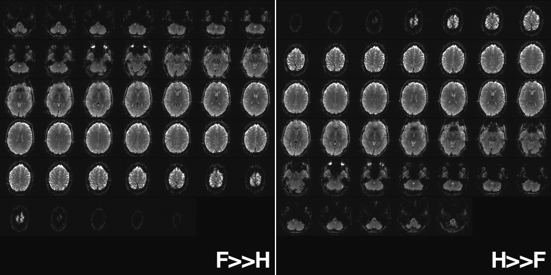

## About

`dcm_qa_mosaic` is a simple DICOM to NIfTI validator script and dataset to test conversion of Siemens mosaic DICOM datasets to the NIfTI format. Specifically, these scan illustrate images where the mosaics are saved with `F>>H` image numbering, instead of the traditional `H>>F` order. Hopefully, users will **never** chose to save in `F>>H` mode, but converters like dcm2niix should handle these images regardless of user settings.

Siemens V-series scanners (e.g. Trio with VB17, Prisma with VE11) can save EPI images in `mosaic` mode where all 2D slices of a 3D volume are saved as a single classic DICOM file. This creates smaller files that saving each 2D slice as a separate classic DICOM file. Users of Siemens X-series (e.g. Vida with XA11) should **never** save data as [mosaics](https://github.com/rordenlab/dcm2niix/issues/236), but should save data as enhanced DICOM (where all slices in a series are saved as a single file).

As described in the Siemens white paper, the user can select to have these mosaics saved in the order foot-to-head (F>>H, with the top-left corner showing the most inferior slice), or with the head-to-foot order (H>>F, with the top left corner showing the most superior slice). This choice does not influence the order that the images are acquired, only how they are stored on disk. As the included Siemens white paper notes: `Do not use the mode H>>F because this complicates the numbering and you will have to sort images manually in most fMRI post-processing tools`. This repository includes images acquired in both modes. While users are discouraged from using H>>F mode, this repository can help post-processing tools handle this unusual image format.

## DataSets

All data was acquired Siemens Prisma with VD13. The default F>>H image numbering is used except where noted.

* 2 `ep2d_Asc`
  * Siemens product sequence.
  * Sequential ascending slice order.

* 4 `ep2d_Int`
  * Siemens product sequence.
  * Interleaved slice order.

* 5 `ep2d_Int_HF`
  * Siemens product sequence.
  * Interleaved slice order.
  * H>>F image numbering.

* 6 `cmrr_Asc`
  * [CMRR](https://www.cmrr.umn.edu/multiband/) sequence.
  * Sequential ascending slice order.
  
* 7 `cmrr_Asc_HF`
  * [CMRR](https://www.cmrr.umn.edu/multiband/) sequence.
  * Sequential ascending slice order.
  * H>>F image numbering.

* 8 `cmrr_Int`
  * [CMRR](https://www.cmrr.umn.edu/multiband/) sequence.
  * Interleaved slice order.

* 9 `cmrr_Int_HF`
  * [CMRR](https://www.cmrr.umn.edu/multiband/) sequence.
  * Interleaved slice order.
  * H>>F image numbering.

* 10 `ep2d_Asc_HF`
  * Siemens product sequence.
  * Sequential ascending slice order.
  * H>>F image numbering.

## Links

 * For more examples of Siemens mosaic images see [dcm_qa](https://github.com/neurolabusc/dcm_qa) (which includes examples of axial and coronal mosaics).
 * The [Slice Timing Correction](https://crnl.readthedocs.io/stc/index.html) page is also relevant.
 * Details about these scans are discussed in [dcm2niix issue 40](https://github.com/rordenlab/dcm2niix/issues/40).